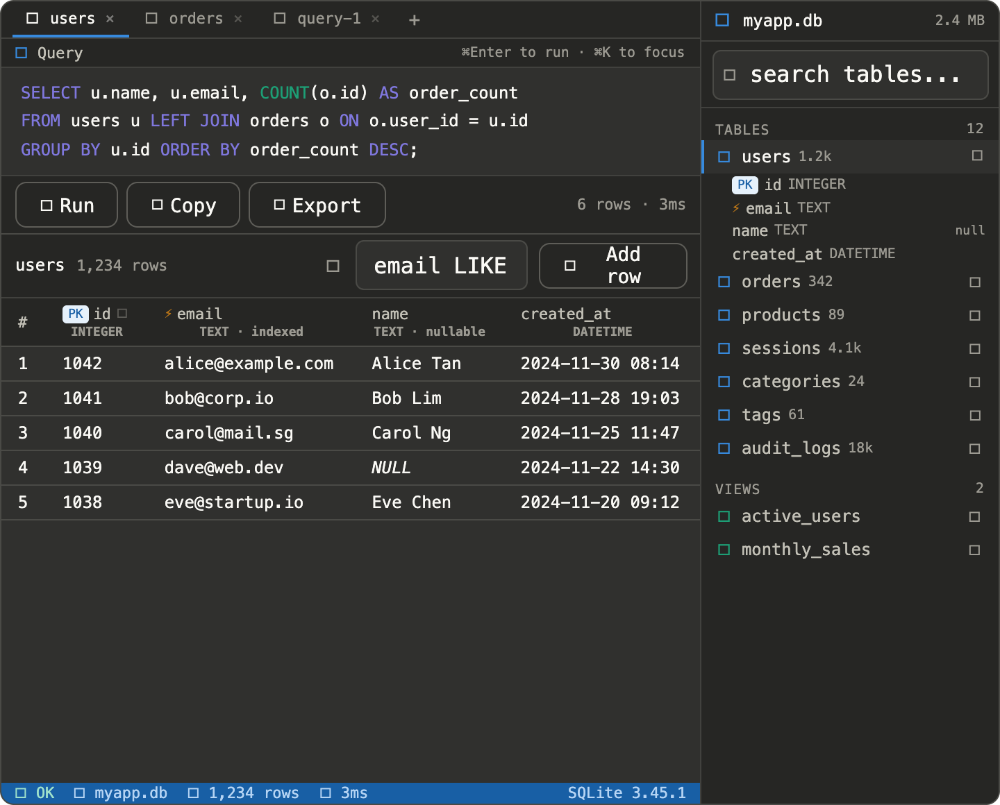
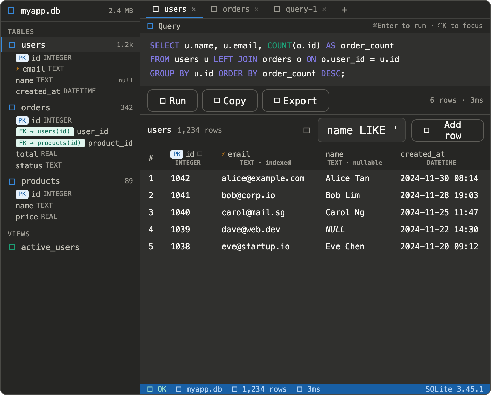
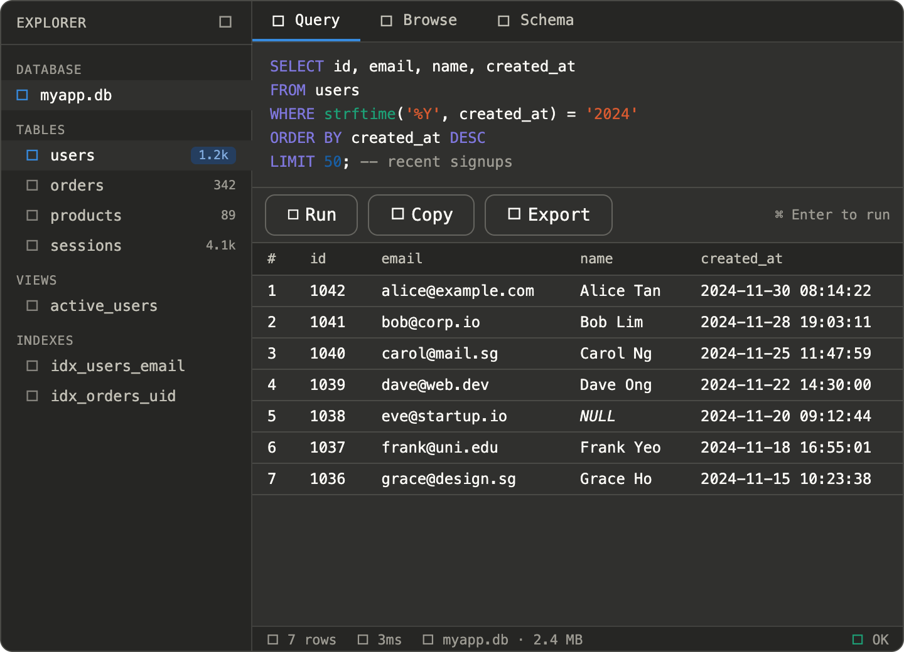

# Goals

Some ideas

some interesting ideas
FK navigation — when you're browsing orders and see user_id = 1042, clicking that value jumps you directly to the users table and highlights the row where id = 1042. You follow the relationship without writing a JOIN. That's FK navigation — treating foreign key values as clickable links rather than dead numbers.
